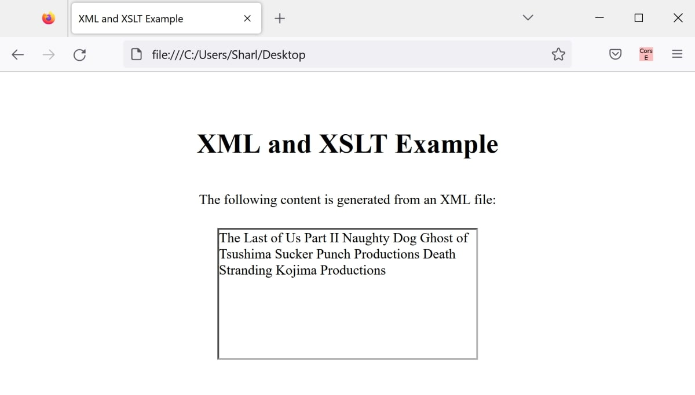

# display-xml-data-in-html-page
This is a simple example to display XML data in a HTML webpage.

The project consists of:
* index.html - Simple HTML page to open in a browser
* data.xml - XML page where data is stored.
* styles.css - Styling for the HTML page.
* xmlstylesheet.xsl - Format and display XML data.

## To Run

* Click on the index.html file to open it in a web browser that supports XSLT (eg, Firefox).

## Example

